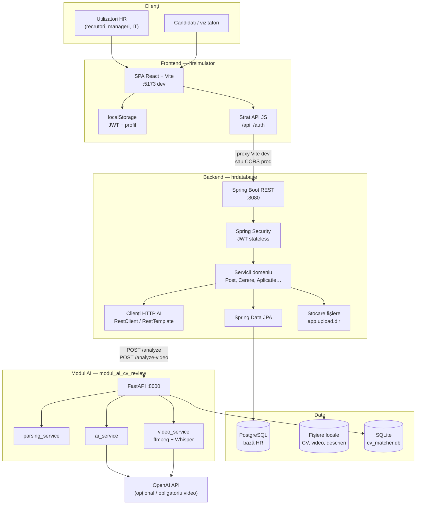
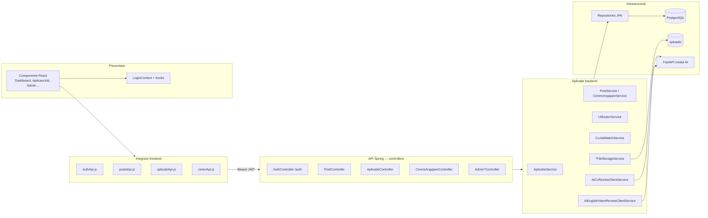
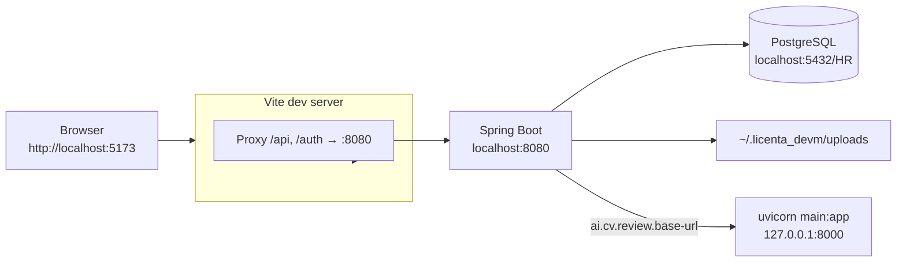
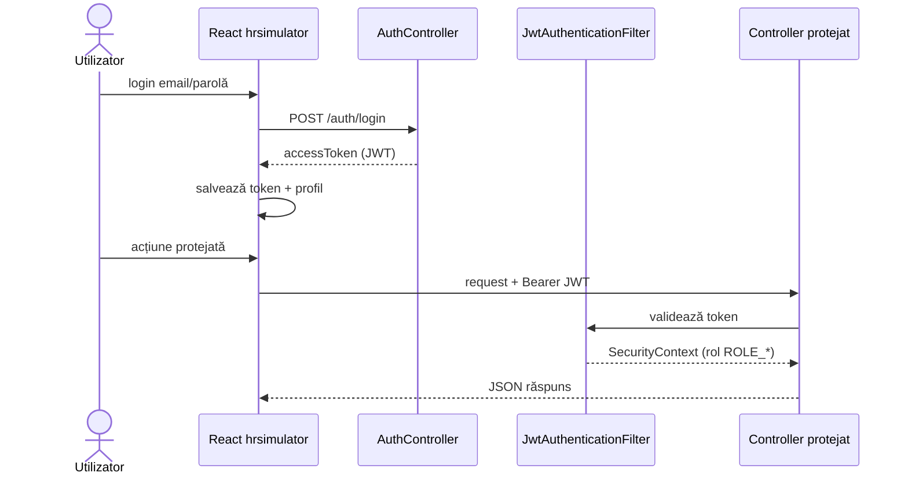
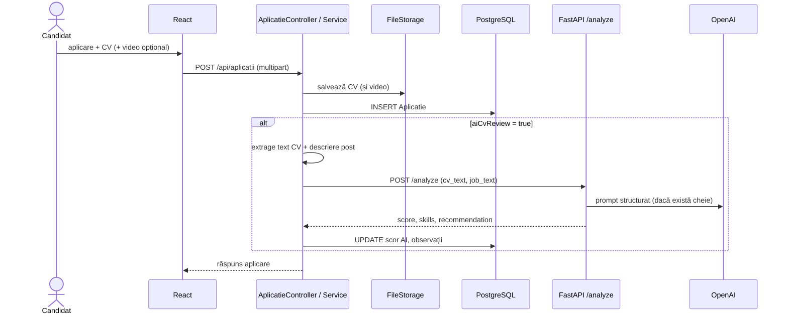
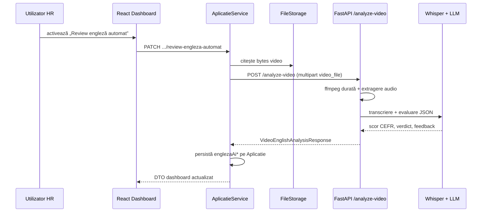
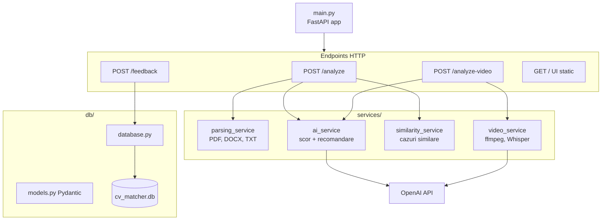

# Diagramă de arhitectură — aplicație HR Database

Documentul descrie arhitectura runtime și integrările proiectului `licenta_devm`: frontend **React / Vite** (`hrsimulator`), backend **Spring Boot** (`backend/hrdatabase`), baza de date **PostgreSQL**, stocare fișiere pe disc și modulul auxiliar **FastAPI** (`module_ai/modul_ai_cv_review`).

Diagramele folosesc [Mermaid](https://mermaid.js.org/) (randare în GitHub, VS Code cu extensie Mermaid, Cursor preview etc.).

---

## 1. Vedere de ansamblu (sistem)

Aplicația HR este un sistem **multi-tier**: utilizatorii interacționează doar cu frontend-ul; backend-ul centralizează autentificarea, regulile de business, persistența și apelurile către serviciul AI. Modulul AI este un proces separat, apelat **server-to-server** de Spring Boot (nu direct din browser).

### Roluri principale ale componentelor

| Componentă | Tehnologie | Responsabilitate |
|------------|------------|------------------|
| `hrsimulator` | React 18, Vite, React Router | UI: login, posturi, cereri, dashboard aplicanți, aplicare job |
| `hrdatabase` | Spring Boot 3, JPA, Security | API REST, JWT, autorizare pe rol, orchestrare AI, upload |
| PostgreSQL | JDBC | Entități: utilizatori, posturi, cereri, aplicații |
| Fișiere locale | `app.upload.dir` | CV, videoclipuri, descrieri job/cerere (PDF/DOCX) |
| `modul_ai_cv_review` | FastAPI, Pydantic | Potrivire CV–job, feedback, analiză engleză din video |
| OpenAI | API extern | LLM pentru scor/recomandare; Whisper + evaluare pentru video |

---

## 2. Arhitectură logică pe straturi

Backend-ul urmează un model **controller → service → repository**, cu securitate declarativă (`@PreAuthorize` / `PermissionExpressions`) pe metodele de serviciu sau controller.

---

## 3. Mediu de dezvoltare (deployment local)

| Port / cale | Serviciu |
|-------------|----------|
| `5173` | Frontend Vite (`npm run dev`) |
| `8080` | Backend Spring Boot (implicit) |
| `5432` | PostgreSQL, baza `HR` |
| `8000` | Modul AI FastAPI |
| `${user.home}/.licenta_devm/uploads` | Rădăcină upload (`application.properties`) |

Configurare relevantă: `hrsimulator/vite.config.js` (proxy), `application.properties` (DB, JWT, CORS, AI, upload).

---

## 4. Securitate și acces API

Autentificarea este **stateless JWT** (HS256). Frontend-ul stochează tokenul în `localStorage` și îl trimite ca `Authorization: Bearer …`.

**Rute publice** (fără JWT), conform `SecurityConfig`:

- `POST /auth/login`, `POST /auth/register`
- `POST /api/aplicatii`, `POST /api/aplicatii/json` — aplicare la job
- `GET /api/posturi/disponibile`, `GET /api/posturi/disponibile/meta` — listă posturi pentru candidați

Toate celelalte rute sub `/api/**` necesită autentificare. Rolurile (`ADMIN`, `RECRUTOR`, `MANAGER_RECRUTARE`, etc.) limitează operațiile în servicii.

---

## 5. Flux: aplicare job + review CV AI

Candidatul trimite formular multipart către backend. Dacă este bifat review AI, backend-ul extrage text CV/job, apelează modulul Python și persistă scorul pe entitatea `Aplicatie`.

**Notă:** Browser-ul **nu** apelează direct `:8000`; doar Spring Boot, prin `AiCvReviewClientService` (`ai.cv.review.enabled`, `ai.cv.review.base-url`).

---

## 6. Flux: review engleză din videoclip

Declanșat din dashboard (utilizatori autorizați), după ce există deja un fișier video salvat pe aplicare.

Pentru acest flux, `OPENAI_API_KEY` este necesară în mediul modulului AI.

---

## 7. Modul AI — structură internă

Feedback-ul uman (`POST /feedback`) alimentează învățarea din cazuri similare pentru analizele viitoare în MVP-ul modulului AI.

---

## 8. Domenii funcționale (mapare UI → API)

| Zonă UI (hrsimulator) | API principal | Observații |
|----------------------|-------------|------------|
| Login / Register | `/auth/*` | JWT; cont nou poate aștepta aprobare rol |
| Acasă / posturi disponibile | `GET /api/posturi/disponibile` | Public |
| Aplicare job | `POST /api/aplicatii` | Public; upload CV până la 10 MB, video până la 200 MB |
| Dashboard recrutare | `GET /api/aplicatii/dashboard` | Filtrare server după rol și atribuiri |
| Cereri angajare | `/api/cereri-angajare` | Manager departament / flux aprobare |
| Administrare | `/api/admin/*`, `/api/utilizatori`, `/api/departamente` | Rol `ADMIN` / manageri |
| Meta HR | `/api/hr` | Recrutori, intervievatori, roluri |

---

## Fișiere sursă principale

| Concern | Locație |
|---------|---------|
| Frontend entry + rute | `hrsimulator/src/App.jsx` |
| Proxy dev | `hrsimulator/vite.config.js` |
| Config backend | `backend/hrdatabase/src/main/resources/application.properties` |
| Securitate JWT | `backend/hrdatabase/.../security/SecurityConfig.java` |
| Client AI CV | `.../service/AiCvReviewClientService.java` |
| Client AI video | `.../service/AiEnglishVideoReviewClientService.java` |
| Modul AI | `module_ai/modul_ai_cv_review/main.py` |
| Diagramă clase | `diagrame/diagrama-clase.md` |

Dacă schimbi porturi, proxy-ul sau integrarea AI, actualizează această diagramă pentru a rămâne aliniată mediului tău de rulare.
