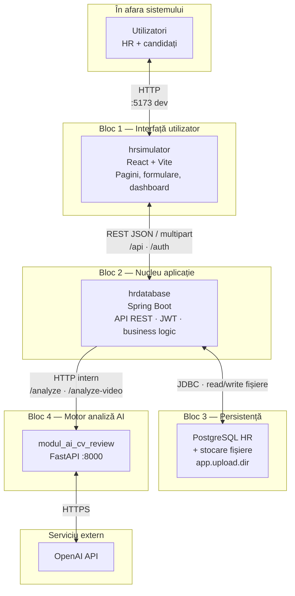
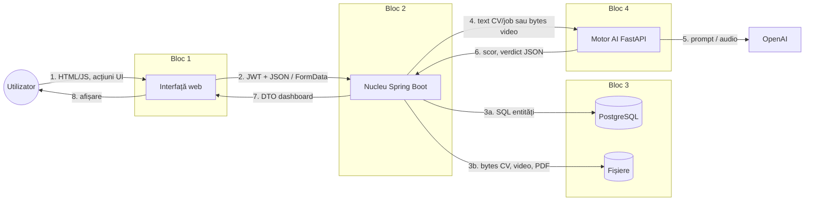
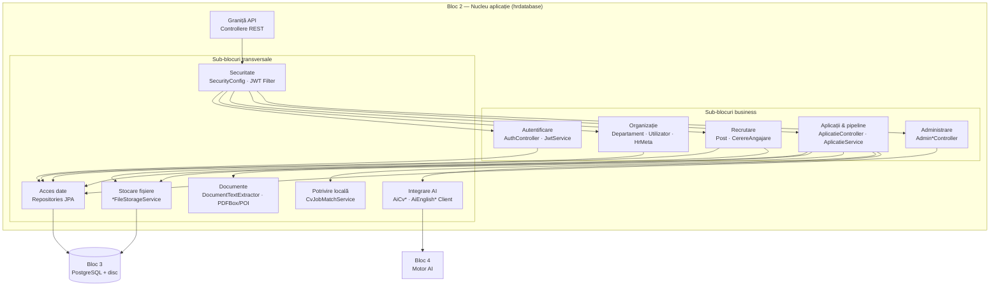
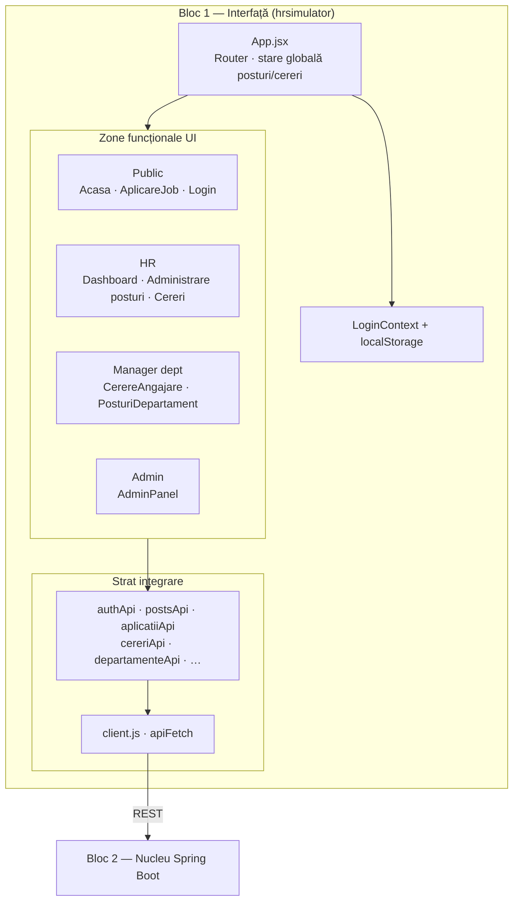
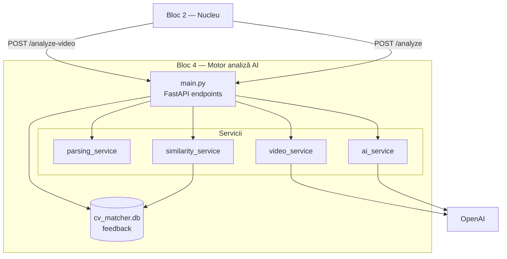
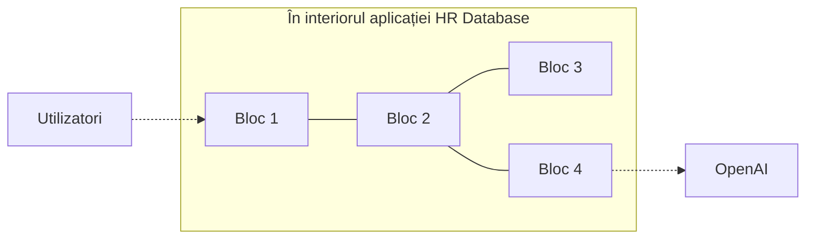

# Schemă bloc (High-Level Design) — Simulator HR

Vedere **high-level** a aplicației `licenta_devm`, derivată din structura codului: blocuri mari, responsabilități și interacțiuni. Detaliul pe module software este în [diagrama-componente.md](./diagrama-componente.md); fluxurile runtime în [diagrama-arhitectura.md](./diagrama-arhitectura.md).

Diagrame [Mermaid](https://mermaid.js.org/) — randare în GitHub, VS Code, Cursor preview.

---

## 1. Schema bloc principală (5 blocuri + externe)

Cele **cinci blocuri** ale sistemului și dependențele externe. Săgețile indică direcția principală a apelului / datelor.



### Tabel bloc → cod sursă

| Bloc | Folder / pachet | Rol |
|------|-----------------|-----|
| **1 — Interfață** | `hrsimulator/src/` | Prezentare, rutare, `apiFetch`, context autentificare |
| **2 — Nucleu** | `backend/hrdatabase/src/main/java/.../hrdatabase/` | Controllere, servicii, securitate, clienți AI |
| **3 — Persistență** | PostgreSQL + `${user.home}/.licenta_devm/uploads` | Entități JPA, CV, video, PDF descrieri |
| **4 — Motor AI** | `module_ai/modul_ai_cv_review/` | Analiză CV–job, feedback, video engleză |
| **Extern** | `platform.openai.com` | LLM, Whisper (prin modul AI) |

---

## 2. High-Level Design — interacțiuni pe tip de date

Aceeași schemă, cu **etichete pe fluxuri** (ce traversează granițele).



| Pas | De la | La | Conținut tipic |
|-----|-------|-----|----------------|
| 1 | Utilizator | UI | click, formulare, navigare |
| 2 | UI | Nucleu | `Authorization: Bearer`, body JSON sau multipart |
| 3a | Nucleu | PostgreSQL | `Utilizator`, `Post`, `CerereAngajare`, `Aplicatie` |
| 3b | Nucleu | Disc | `cv/`, `video/`, `cereri/`, `posturi/` |
| 4 | Nucleu | Motor AI | `cv_text` + `job_text` sau `video_file` |
| 5 | Motor AI | OpenAI | completări chat, transcriere Whisper |
| 6–8 | Retur | Utilizator | scor AI, pipeline, fișiere descărcabile |

**Important:** Blocul 1 **nu** apelează Blocul 4 direct; toate cererile AI trec prin Blocul 2 (`AiCvReviewClientService`, `AiEnglishVideoReviewClientService`).

---

## 3. Decompunere Bloc 2 — sub-blocuri domeniu (tot high-level)

Nucleul Spring Boot, împărțit pe **capabilități** mapate la controllere/servicii din cod (fără a detalia fiecare clasă).



### Mapare sub-bloc → API (prefixe)

| Sub-bloc | Controllere principale | Servicii reprezentative |
|----------|------------------------|-------------------------|
| Autentificare | `AuthController` | `AuthService`, `JwtService` |
| Organizație | `DepartamentController`, `UtilizatorController`, `HrMetaController` | `DepartamentService`, `UtilizatorService` |
| Recrutare | `PostController`, `CerereAngajareController` | `PostService`, `CerereAngajareService`, `PostAccessService` |
| Aplicații | `AplicatieController` | `AplicatieService` |
| Administrare | `AdminCatalogController`, `AdminCerereAngajareController`, `AdminPostAssignmentController`, `AdminAplicatieMatchController` | servicii asociate |
| Integrare AI | — (fără controller public) | `AiCvReviewClientService`, `AiEnglishVideoReviewClientService` |

---

## 4. Decompunere Bloc 1 — sub-blocuri UI



---

## 5. Decompunere Bloc 4 — sub-blocuri motor AI



---

## 6. Vedere bloc (sintaxă block — alternativă)

Diagramă compactă tip **block diagram** (Mermaid `block-beta`; necesită renderer recent).

```mermaid
block-beta
    columns 3

    block:groupUI:1
        ui["Bloc 1: Interfață\nReact / hrsimulator"]
    block:groupCore:1
        core["Bloc 2: Nucleu\nSpring Boot / hrdatabase"]
    block:groupData:1
        data["Bloc 3: Persistență\nPostgreSQL + fișiere"]

    block:groupAI:1
        ai["Bloc 4: Motor AI\nFastAPI"]
    block:groupExt:1
        oai["OpenAI"]

    ui --> core
    core --> data
    core --> ai
    ai --> oai
```

---

## 7. Legenda și graniți de sistem



| Graniță | Ce nu traversează |
|---------|------------------|
| Utilizator → doar Bloc 1 | Nu există acces direct la PostgreSQL, fișiere sau FastAPI din browser |
| Bloc 1 → doar Bloc 2 | Frontend-ul nu cunoaște URL-ul OpenAI |
| Bloc 4 → OpenAI | Cheia API rămâne în mediul Python |

---

## Fișiere sursă

| Bloc | Locație |
|------|---------|
| 1 | `hrsimulator/` |
| 2 | `backend/hrdatabase/` |
| 3 | `application.properties` (`spring.datasource`, `app.upload.dir`) |
| 4 | `module_ai/modul_ai_cv_review/` |

La modificări majore de structură (ex. nou microserviciu), actualizează această schemă bloc înainte de diagramele detaliate.
