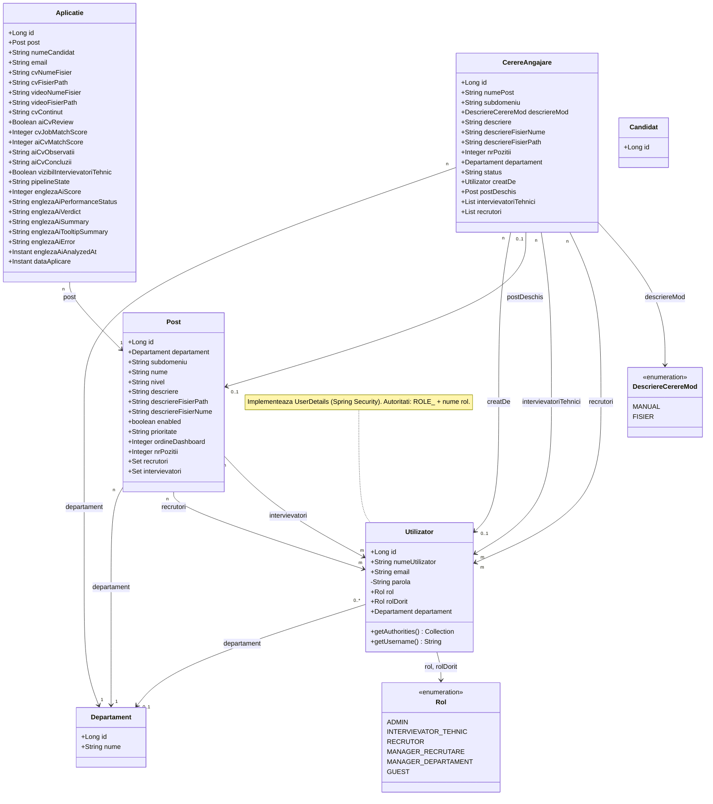
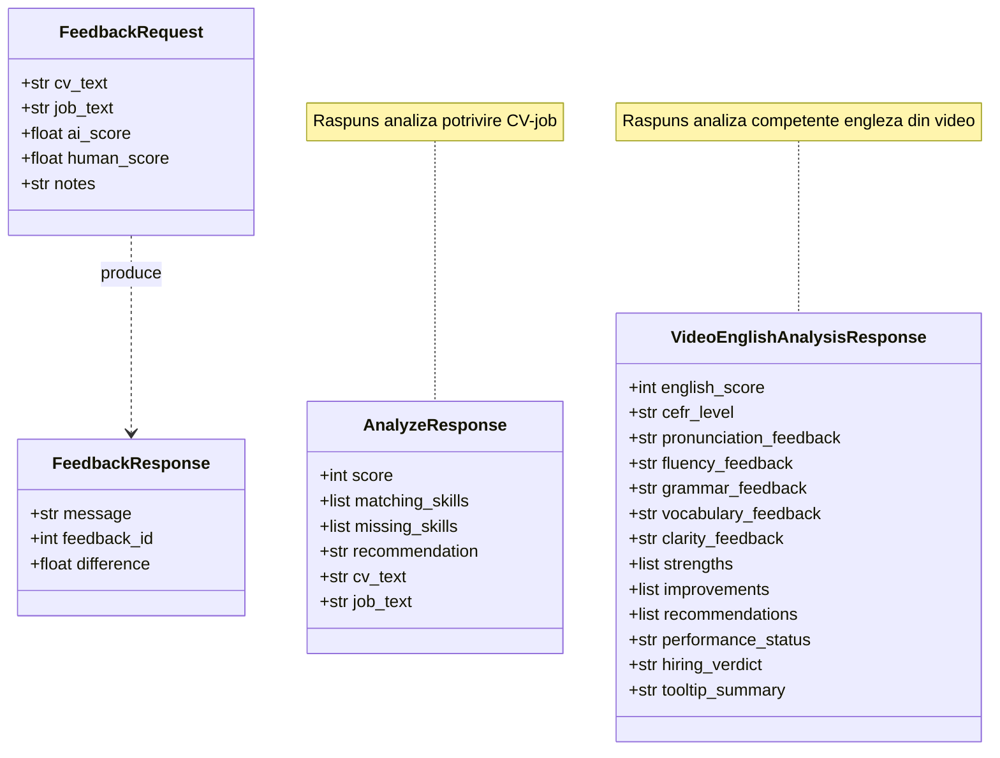

# Diagramă de clase — aplicație HR Database

Documentul descrie modelul de domeniu și tipurile auxiliare din proiectul `licenta_devm`: backend **Spring Boot / JPA** (`backend/hrdatabase`) și contractele **Pydantic** din serviciul AI (`module_ai/modul_ai_cv_review`).

Diagramele folosesc [Mermaid](https://mermaid.js.org/syntax/classDiagram.html) (randare în GitHub, VS Code cu extensie Mermaid, Cursor preview etc.).

---

## 1. Model de persistență (entități JPA)

Relațiile reflectă mapările din pachetul `com.example.hrdatabase.entity`.

### Legături tabele de asociere (JPA)

| Relație | Tabel join |
|--------|------------|
| `Post` ↔ `Utilizator` (recrutori) | `post_recrutori` |
| `Post` ↔ `Utilizator` (intervievatori) | `post_intervievatori` |
| `CerereAngajare` ↔ `Utilizator` (intervievatori) | `cerere_angajare_intervievatori` |
| `CerereAngajare` ↔ `Utilizator` (recrutori) | `cerere_angajare_recrutori` |

Entitatea `Candidat` există în cod (`candidat`) cu un singur identificator; nu este legată prin JPA de celelalte clase de mai sus în forma actuală.

---

## 2. Modul AI — modele Pydantic (`modul_ai_cv_review`)

Contracte de request/response HTTP folosite de serviciul Python (ex.: analiză CV, feedback, analiză video engleză).

---

## Fișiere sursă principale

- Entități JPA: `backend/hrdatabase/src/main/java/com/example/hrdatabase/entity/`
- Modele AI: `module_ai/modul_ai_cv_review/db/models.py`

Dacă actualizezi entitățile sau DTO-urile, regenerează sau adaptează manual diagramele de mai sus pentru a rămâne aliniate codului.
