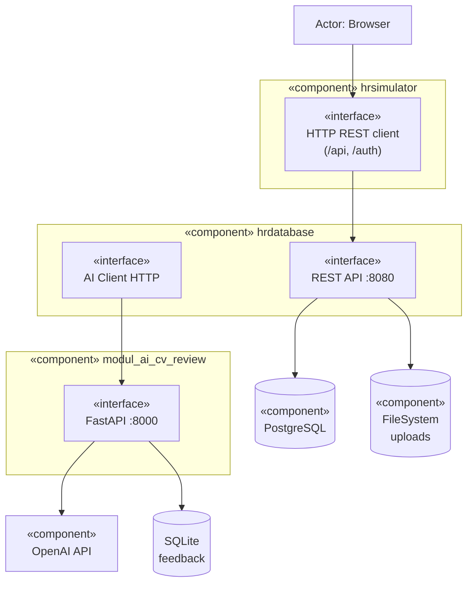
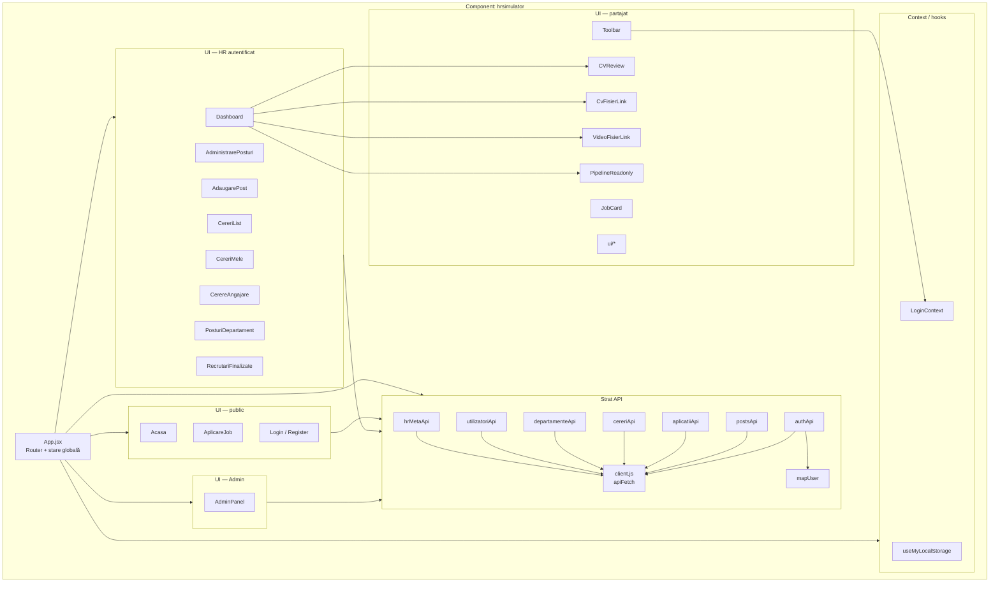
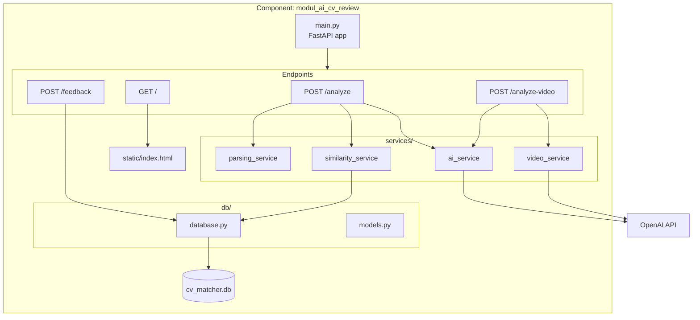
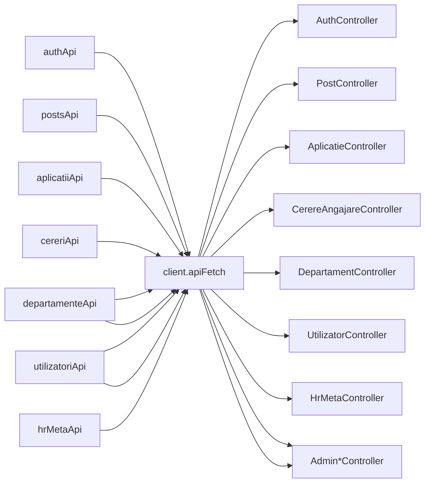
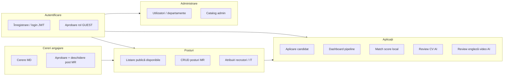

# Diagramă de componente — aplicație HR Database

Documentul descrie **componentele software** din `licenta_devm` și **dependențele** între ele (ce furnizează / ce consumă fiecare modul). Complementează [diagrama-arhitectura.md](./diagrama-arhitectura.md) (fluxuri runtime) și [diagrama-clase.md](./diagrama-clase.md) (model de domeniu).

Diagramele folosesc [Mermaid](https://mermaid.js.org/). Pentru o diagramă UML strictă de componente, aceeași structură poate fi redată în PlantUML cu stereotipul `component`.

---

## 1. Componente de nivel sistem

Trei artefacte deployabile principale + infrastructură externă.

| Componentă | Pachet / folder | Rol |
|------------|-----------------|-----|
| **hrsimulator** | `hrsimulator/` | SPA React; prezentare și apeluri HTTP |
| **hrdatabase** | `backend/hrdatabase/` | API, securitate, business logic, JPA |
| **modul_ai_cv_review** | `module_ai/modul_ai_cv_review/` | Analiză CV–job, feedback, video engleză |
| **PostgreSQL** | extern | Persistență relațională |
| **FileSystem** | `app.upload.dir` | CV, video, descrieri fișier |

---

## 2. Frontend — `hrsimulator`

### 2.1 Structură componente

### 2.2 Mapare rute → componente UI

| Rută | Componentă principală | Modul API |
|------|------------------------|-----------|
| `/` | `Acasa` | `postsApi` (disponibile) |
| `/aplicare-job` | `AplicareJob` | `aplicatiiApi` |
| `/login`, `/register` | `Login`, `Register` | `authApi` |
| `/dashboard` | `Dashboard` | `aplicatiiApi`, `postsApi` |
| `/administrare-posturi` | `AdministrarePosturi` | `postsApi`, `hrMetaApi`, `departamenteApi` |
| `/cereri` | `CereriList` | `cereriApi` |
| `/cerere-angajare` | `CerereAngajare` | `cereriApi` |
| `/cererile-mele` | `CereriMele` | `cereriApi` |
| `/posturi-departament` | `PosturiDepartament` | `postsApi` |
| `/admin` | `AdminPanel` | `utilizatoriApi`, `departamenteApi`, `hrMetaApi` |
| `/cont-in-asteptare` | `ContInAsteptare` | — |

---

## 3. Backend — `hrdatabase`

### 3.1 Controllere (interfață REST expusă)

```mermaid
flowchart LR
    subgraph controllers["«component» Controllere REST"]
        AuthC["AuthController<br/>/auth"]
        PostC["PostController<br/>/api/posturi"]
        AplC["AplicatieController<br/>/api/aplicatii"]
        CerC["CerereAngajareController<br/>/api/cereri-angajare"]
        DeptC["DepartamentController<br/>/api/departamente"]
        UserC["UtilizatorController<br/>/api/utilizatori"]
        HrC["HrMetaController<br/>/api/hr"]
        AdmCat["AdminCatalogController"]
        AdmCer["AdminCerereAngajareController"]
        AdmPost["AdminPostAssignmentController"]
        AdmApl["AdminAplicatieMatchController"]
        GEH["GlobalExceptionHandler"]
    end
```

### 3.2 Servicii și dependențe interne

```mermaid
flowchart TB
    subgraph security["«component» security"]
        SEC_CFG["SecurityConfig"]
        JWT_F["JwtAuthenticationFilter"]
        JWT_S["JwtService"]
        UDS["SecurityUserDetailsService"]
        PERM["PermissionExpressions"]
    end

    subgraph services["«component» service"]
        AuthS["AuthService"]
        PostS["PostService"]
        PostAcc["PostAccessService"]
        CerS["CerereAngajareService"]
        AplS["AplicatieService"]
        UserS["UtilizatorService"]
        DeptS["DepartamentService"]
        CandS["CandidatService"]
        CvMatch["CvJobMatchService"]
        DocExt["DocumentTextExtractor"]
        RoleClean["RoleAssignmentCleanupService"]
        AiCv["AiCvReviewClientService"]
        AiVid["AiEnglishVideoReviewClientService"]
    end

    subgraph storage["«component» storage"]
        StorCv["AplicatieCvFileStorageService"]
        StorPost["PostDescriereFileStorageService"]
        StorCer["CerereDescriereFileStorageService"]
    end

    subgraph repos["«component» repository"]
        RUser["UtilizatorRepository"]
        RPost["PostRepository"]
        RApl["AplicatieRepository"]
        RCer["CerereAngajareRepository"]
        RDept["DepartamentRepository"]
        RCand["CandidatRepository"]
        SpecU["UtilizatorSpecifications"]
        SpecD["DepartamentSpecifications"]
    end

    subgraph mappers["«component» mapper"]
        MUser["UtilizatorMapper"]
        MPost["PostMapper"]
        MCer["CerereAngajareMapper"]
    end

    subgraph config["«component» config"]
        AiProps["AiCvReviewProperties"]
        AiCfg["AiCvReviewConfig"]
        Backfill["DatabaseBackfillRunner"]
    end

    subgraph external["Extern"]
        PG[("PostgreSQL")]
        DISK[("FileSystem")]
        FASTAPI["modul_ai_cv_review"]
    end

    AuthC --> AuthS
    PostC --> PostS
    AplC --> AplS
    CerC --> CerS
    DeptC --> DeptS
    UserC --> UserS
    HrC --> UserS

    AuthS --> JWT_S
    AuthS --> RUser
    PostS --> RPost
    PostS --> PostAcc
    PostS --> StorPost
    PostS --> MPost
    CerS --> RCer
    CerS --> StorCer
    CerS --> MCer
    AplS --> RApl
    AplS --> RPost
    AplS --> StorCv
    AplS --> AiCv
    AplS --> AiVid
    AplS --> CvMatch
    AplS --> DocExt
    AplS --> PostAcc
    UserS --> RUser
    UserS --> MUser
    DeptS --> RDept

    AiCv --> AiProps
    AiVid --> AiProps
    AiCfg --> AiCv
    AiCfg --> AiVid

    repos --> PG
    storage --> DISK
    AiCv --> FASTAPI
    AiVid --> FASTAPI

    SEC_CFG --> JWT_F
    JWT_F --> JWT_S
    JWT_F --> UDS
    UDS --> RUser
```

### 3.3 Tabel dependențe servicii → infrastructură

| Serviciu | Repository / storage | Alte componente |
|----------|----------------------|-----------------|
| `AuthService` | `UtilizatorRepository` | `JwtService`, `PasswordEncoder` |
| `PostService` | `PostRepository` | `PostAccessService`, `PostDescriereFileStorageService`, `PostMapper` |
| `CerereAngajareService` | `CerereAngajareRepository` | `CerereDescriereFileStorageService`, `UtilizatorRepository` |
| `AplicatieService` | `AplicatieRepository`, `PostRepository` | storage CV/video, `AiCvReviewClientService`, `AiEnglishVideoReviewClientService`, `CvJobMatchService`, `DocumentTextExtractor` |
| `UtilizatorService` | `UtilizatorRepository` | `UtilizatorMapper`, `RoleAssignmentCleanupService` |
| `DepartamentService` | `DepartamentRepository` | — |
| `AiCvReviewClientService` | — | `RestClient` → FastAPI `/analyze` |
| `AiEnglishVideoReviewClientService` | — | `RestTemplate` → FastAPI `/analyze-video` |

### 3.4 Entități JPA (componentă model)

| Entitate | Repository |
|----------|------------|
| `Utilizator` | `UtilizatorRepository` |
| `Departament` | `DepartamentRepository` |
| `Post` | `PostRepository` |
| `CerereAngajare` | `CerereAngajareRepository` |
| `Aplicatie` | `AplicatieRepository` |
| `Candidat` | `CandidatRepository` |
| `Rol`, `DescriereCerereMod` | (enum-uri în entități) |

---

## 4. Modul AI — `modul_ai_cv_review`

| Componentă | Fișier | Responsabilitate |
|------------|--------|------------------|
| `main.py` | rutare HTTP, validare input | |
| `parsing_service` | extragere text PDF/DOCX/TXT | |
| `ai_service` | prompt LLM, scor structurat | |
| `similarity_service` | cazuri similare din feedback | |
| `video_service` | ffmpeg, Whisper, evaluare engleză | |
| `database.py` | CRUD feedback SQLite | |
| `models.py` | contracte Pydantic request/response | |

---

## 5. Interfețe între componente (contracte)

### 5.1 Frontend → Backend

Toate modulele `*Api.js` folosesc `apiFetch` din `client.js` (JSON sau `FormData`, header `Authorization` opțional).

### 5.2 Backend → Modul AI

| Client Java | Endpoint | Body | Răspuns DTO |
|-------------|----------|------|-------------|
| `AiCvReviewClientService` | `POST /analyze` | `cv_text`, `job_text` (form) | `AiCvAnalyzeResponse` |
| `AiEnglishVideoReviewClientService` | `POST /analyze-video` | `video_file` (multipart) | `AiEnglishVideoApiResponse` |

Configurare: prefix `ai.cv.review.*` în `AiCvReviewProperties`, beans în `AiCvReviewConfig`.

### 5.3 DTO-uri (straturi de contract)

| Strat | Locație | Rol |
|-------|---------|-----|
| Request/Response REST | `dto/request`, `dto/response` | JSON API Spring |
| AI bridge | `dto/ai` | mapare JSON FastAPI ↔ entitate `Aplicatie` |
| Pydantic | `module_ai/.../db/models.py` | schema modul AI |

---

## 6. Diagramă componente — aplicații (pipeline recrutare)

Vedere pe **capabilități** (nu pe fișiere), pentru licență / documentație funcțională.

| Capabilitate | Componente implicate (principal) |
|--------------|----------------------------------|
| Autentificare | `Login`, `authApi`, `AuthController`, `AuthService`, `SecurityConfig` |
| Posturi | `Acasa`, `AdministrarePosturi`, `PostController`, `PostService` |
| Cereri | `CerereAngajare`, `CereriList`, `CerereAngajareController`, `CerereAngajareService` |
| Aplicații | `AplicareJob`, `Dashboard`, `AplicatieController`, `AplicatieService` |
| AI CV | `CVReview`, `AiCvReviewClientService`, FastAPI `/analyze` |
| AI engleză | `Dashboard`, `AiEnglishVideoReviewClientService`, `/analyze-video` |

---

## Fișiere sursă principale

| Componentă | Locație |
|------------|---------|
| Shell frontend | `hrsimulator/src/App.jsx`, `main.jsx` |
| API client | `hrsimulator/src/api/client.js` |
| Controllere | `backend/hrdatabase/.../controller/` |
| Servicii | `backend/hrdatabase/.../service/` |
| Securitate | `backend/hrdatabase/.../security/` |
| Repositories | `backend/hrdatabase/.../repository/` |
| Modul AI | `module_ai/modul_ai_cv_review/main.py`, `services/`, `db/` |
| Arhitectură | `diagrame/diagrama-arhitectura.md` |
| Clase | `diagrame/diagrama-clase.md` |

La adăugarea unui controller, serviciu sau modul `*Api.js`, actualizează diagramele și tabelele de mai sus.
