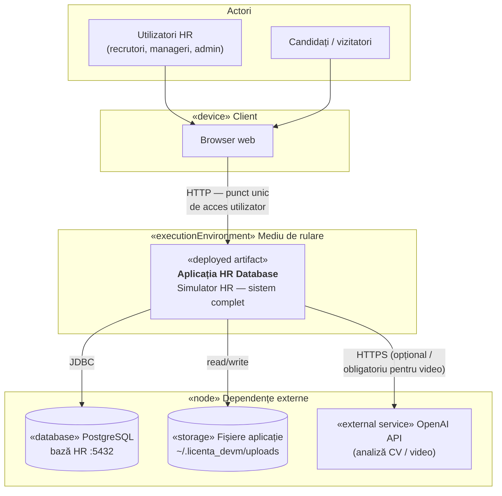
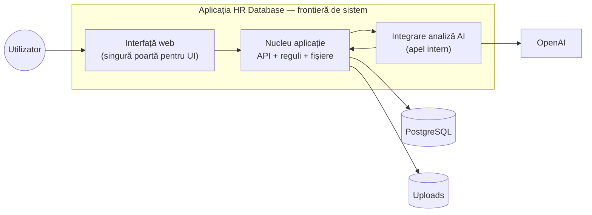
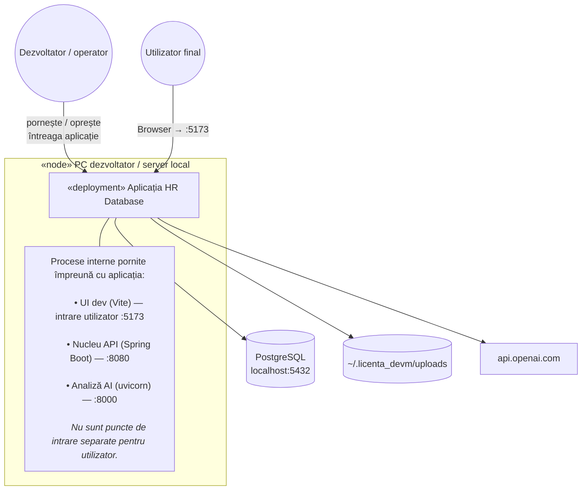
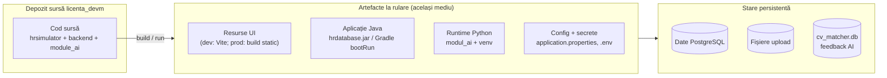
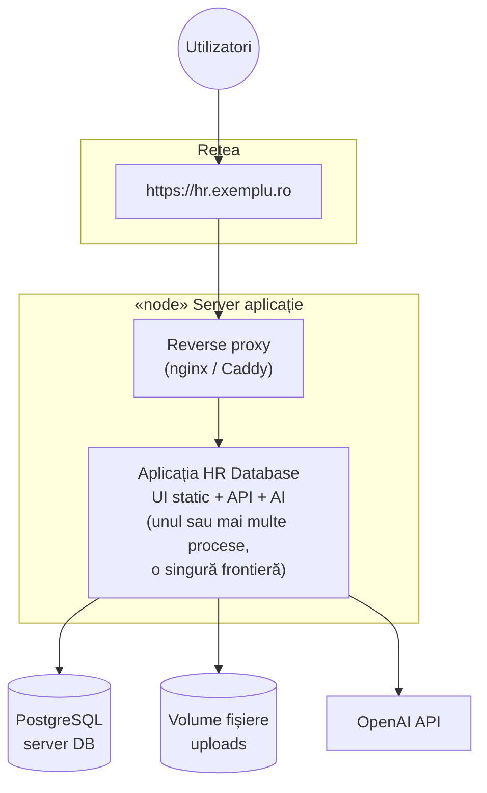

# Diagramă de desfășurare — aplicație HR Database

Documentul descrie **unde rulează aplicația ta**, privită ca **un singur sistem** („Aplicația HR Database” / „Simulator HR”), nu ca trei produse separate (frontend, backend, modul AI). Procesele interne (Vite, Spring Boot, FastAPI) sunt **detalii de implementare** din același mediu de rulare; utilizatorul și documentația de licență văd **un punct de intrare** și **un set de dependențe externe**.

Pentru descompunerea pe straturi, vezi [diagrama-arhitectura.md](./diagrama-arhitectura.md) și [diagrama-componente.md](./diagrama-componente.md).

Diagramele folosesc [Mermaid](https://mermaid.js.org/).

---

## 1. Vedere unitară — ce se deployează

Artefactul logic deployat este **întreaga aplicație HR**: interfață web, API, logică de business, integrare AI și persistență orchestrate împreună. Nu există, în documentația aceasta, trei aplicații distincte la nivel de desfășurare — există **o aplicație** și câteva **sisteme externe** de care depinde.

### Ce înseamnă „Aplicația HR Database” (un singur tot)

| Inclus în artefactul unitar | Rol (intern, nedeployat separat în această diagramă) |
|----------------------------|------------------------------------------------------|
| Interfață web | React + Vite (`hrsimulator`) |
| Serviciu aplicație | Spring Boot (`hrdatabase`) — API, JWT, JPA |
| Motor analiză AI | FastAPI (`modul_ai_cv_review`) — apelat intern de serviciul aplicație |
| Configurare comună | `application.properties`, proxy Vite dev, `ai.cv.review.base-url` |

Utilizatorul **nu** accesează direct porturile 8080 sau 8000 în fluxul normal: în dezvoltare intră pe **un URL** (frontend), iar restul comunicării este internă mediului de rulare.

---

## 2. Punct unic de acces și comunicații

| Legătură | De la | Către | Protocol / observație |
|---------|-------|-------|------------------------|
| Utilizare | Browser | **Aplicația** (UI) | HTTP(S) — ex. `http://localhost:5173` în dev |
| Date structurate | Aplicația | PostgreSQL | JDBC `localhost:5432/HR` |
| Documente | Aplicația | Disc local | `${user.home}/.licenta_devm/uploads` |
| Inteligență artificială | Aplicația | OpenAI | API key în mediul modulului AI |

În **mediul de dezvoltare** actual, proxy-ul Vite redirecționează `/api` și `/auth` către nucleul aplicației (port 8080) — aceasta este o **legătură internă**, nu o a doua aplicație pentru utilizator.

---

## 3. Nod de desfășurare — mediu local (dezvoltare)

Tot sistemul rulează, în practică, pe **aceeași mașină** (ex. Windows 10/11). Un singur nod găzduiește artefactul aplicație; dependențele externe sunt PostgreSQL (același host sau rețea locală) și serviciul cloud OpenAI.

### Pornirea aplicației ca tot unitar

Pentru ca **întregul sistem** să fie funcțional, trebuie active toate procesele interne și dependența PostgreSQL:

| Pas | Acțiune | Face parte din |
|-----|---------|----------------|
| 1 | PostgreSQL pornit, baza `HR` disponibilă | Infrastructură externă |
| 2 | `uvicorn` în `module_ai/modul_ai_cv_review` | Aplicația (subsistem AI) |
| 3 | Spring Boot `hrdatabase` | Aplicația (nucleu) |
| 4 | `npm run dev` în `hrsimulator` | Aplicația (UI) |
| 5 | (Opțional) `OPENAI_API_KEY` setat | Capabilități AI complete |

Dacă lipsește un proces intern, **aplicația unitară** este parțial indisponibilă (ex. fără AI — aplicările merg, dar review-ul CV/video eșuează).

---

## 4. Artefacte și reprezentare fizică

La nivel de **artefact deployat**, proiectul sursă `licenta_devm` se materializează astfel:

| Stare | Locație tipică | Proprietar logic |
|-------|----------------|------------------|
| Utilizatori, posturi, aplicații | PostgreSQL `HR` | Aplicația |
| CV, video, PDF descrieri | `app.upload.dir` | Aplicația |
| Feedback învățare AI | `cv_matcher.db` (lângă modul AI) | Aplicația (capabilitate AI) |

---

## 5. Mediu de producție (vedere unitară, conceptuală)

În producție, același **tot unitar** poate fi expus printr-un **singur domeniu**; procesele interne stau în spatele unui reverse proxy — utilizatorul vede tot **o aplicație**.

Această variantă nu este neapărat implementată în repo; ilustrează că **desfășurarea documentată** rămâne un singur sistem, indiferent câte procese OS rulează în spate.

---

## 6. Matrice: elemente din diagramă vs. folder repo

Pentru aliniere cu codul, fără a sparge diagrama în „3 aplicații”:

| Element diagramă (unitar) | Reprezentare în cod (referință) |
|---------------------------|----------------------------------|
| Interfață web | `hrsimulator/` |
| Nucleu API + persistență | `backend/hrdatabase/` |
| Integrare AI | `module_ai/modul_ai_cv_review/` |
| Configurare globală | `application.properties`, `vite.config.js` |
| Intrare utilizator (dev) | `http://localhost:5173` |
| Bază de date | `jdbc:postgresql://localhost:5432/HR` |

---

## Fișiere sursă și documente înrudite

| Document | Conținut |
|----------|----------|
| `diagrame/diagrama-arhitectura.md` | Fluxuri și integrări (vedere tehnică) |
| `diagrame/diagrama-componente.md` | Module software interne |
| `diagrame/diagrama-clase.md` | Model de domeniu |
| `backend/hrdatabase/src/main/resources/application.properties` | DB, upload, AI, CORS |
| `hrsimulator/vite.config.js` | Proxy dev către nucleu |

Dacă schimbi modul de publicare (un singur container, un singur port public), actualizează **punctul unic de acces** din secțiunile 2 și 5, păstrând aplicația ca tot unitar.
